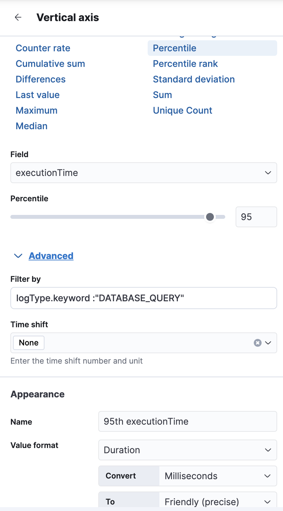

# DB Lock & Slow Query 감지 (트랜잭션 병목 분석)

## 📊 차트 유형: Line Chart + Table (복합 분석)
- **Line Chart (선 차트)**: 시간대별 DB Lock & Slow Query 발생 추이 분석
- **Table Chart (테이블 차트)**: 실행된 SQL, 실행 시간, 데이터 소스, 영향을 받은 행 개수 등 상세 정보 확인

## 📌 X축: 시간 (`timestamp`)
- DB Lock & Slow Query가 **언제 발생했는지 시간대별 분석 가능하도록 설정**

## 📌 Y축:
- **DB Lock 발생 횟수 (Count of Locks)**
    - 특정 시간대에 DB Lock이 얼마나 자주 발생하는지 분석
- **Slow Query 실행 횟수 (Count of Slow Queries)**
    - 응답 시간이 긴 쿼리(`executionTime`이 특정 임계치 이상)를 얼마나 실행했는지 분석

---

## 📝 설명: DB 성능 모니터링 및 병목 분석
### 🔹 **1. DB Lock & Slow Query 발생 패턴 분석**
- 특정 시간대에 **Slow Query 실행 횟수 증가 여부 분석 가능**
- **DB Lock 발생 시점과 Slow Query 증가 패턴의 상관관계 분석 가능**
- 데이터베이스의 **트랜잭션 병목이 발생하는 시간대 확인**

### 🔹 **2. 쿼리 실행 시간(95th Percentile) 분석**
- 특정 SQL 쿼리가 **평균적으로 실행 시간이 오래 걸리는지** 확인 가능
- **실행 시간이 긴 주요 SQL을 식별하여 성능 최적화 가능**
- 실행 시간이 급증하는 경우 **DB 인덱스 튜닝 또는 캐싱 전략 검토 필요**

### 🔹 **3. WARN / ERROR 로그 발생 여부 분석**
- 특정 시간대에 WARN 또는 ERROR 로그가 많다면 **DB 관련 장애 가능성 있음**
- **INFO, WARN, ERROR 로그 레벨별 발생 패턴 분석 가능**
- **ERROR 로그 급증 시 운영팀에서 원인 분석 가능**

### 🔹 **4. 실시간 알람 연계 가능**
- 특정 SQL 실행 시간이 **N초 이상 지속될 경우, Slack 알림 전송 가능**
- **DB Lock이 일정 횟수 이상 발생하면 경고 알림 설정 가능**
- **Kibana Alerting 기능을 활용하여 장애 발생 시 즉각적인 대응 가능**

---

## 🎯 **결론: 이 대시보드의 핵심 목표**
✔ **DB 트랜잭션 병목을 빠르게 감지하고, 성능 튜닝 필요 여부를 파악**  
✔ **Slow Query 및 DB Lock 발생 패턴을 분석하여 최적화 방향 수립**  
✔ **운영 자동화를 통해 장애 발생 시 신속하게 대응 가능**

---

#### y축 설정

#### breakdouwn 설정

#### 결과물

#### y축 logType DB QUERY만 필터링 및 95 설정

#### breakdouwn 설정

#### 결과물

