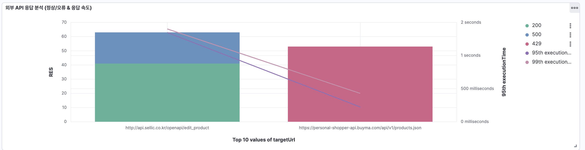

# 외부 API 장애 감지 (3rd Party API 상태 모니터링)

## 📊 차트 유형: Bar Chart + Line Chart (복합 분석)
- **Bar Chart (막대 차트)**: 각 API의 응답 상태(정상/오류) 및 장애 유형 시각화
- **Line Chart (선 차트)**: API별 응답 시간(95th, 99th Percentile) 분석

## 📌 X축: 외부 API 이름 (PG사 API, 물류 API, 외부몰 API 등)
- API 호출이 발생한 **외부 시스템의 엔드포인트 (targetUrl)**
- 상위 10개 API를 기준으로 장애 분석 수행

## 📌 Y축: 장애 발생 횟수 (Count) & 응답 시간 (Execution Time)
- **응답 횟수(Bar Chart)**: 특정 API에서 발생한 응답 개수를 상태 코드별로 구분 (200, 400, 500 등)
- **응답 시간(Line Chart)**: 해당 API의 응답 시간(95th, 99th Percentile) 표시

---

## 📝 설명: 외부 API 장애 모니터링 목적 및 분석 활용
### 🔹 **1. 장애 패턴 분석 및 백오프(Backoff) 전략 수립**
- 특정 API에서 장애(500, 429 등)가 반복 발생하는 경우, **백오프 전략(재시도 간격 조정) 필요**
- 장애 발생 비율이 높은 API에 대한 **자동 재시도(Retry) 정책 최적화 가능**
- API 장애 발생 추이를 장기적으로 분석하여 **대체 API 도입 고려 가능**

### 🔹 **2. 장애가 전체 시스템에 미치는 영향 분석**
- 특정 API(예: PG사 결제 API)의 장애가 **다른 시스템(주문, 배송)까지 영향을 주는지 파악 가능**
- 주요 API의 **응답 지연이 전체 서비스 장애로 이어지는지 분석 가능**
- 특정 시간대에 장애가 집중되는 경우, **트래픽 관리 또는 부하 분산 필요성 검토 가능**

### 🔹 **3. 상태 코드별 장애 유형 세분화**
- **실제 상태 코드(200, 400, 500 등) 기준으로 세분화**
- 장애 유형을 상세하게 분석하여 **자주 발생하는 오류 코드(예: 502 Bad Gateway, 429 Too Many Requests) 파악 가능**

### 🔹 **4. 응답 속도(Execution Time)와 장애 간의 관계 분석**
- 특정 API의 **응답 시간이 길어질 때 장애가 함께 증가하는지 분석 가능**
- 95th, 99th Percentile 값을 기반으로 **API 응답 지연 문제를 사전에 감지 가능**
- API별 SLA 준수 여부 모니터링 가능 (예: 응답 시간이 2초 이상이면 SLA 위반)

---

## 🎯 **결론: 이 대시보드의 핵심 목표**
✔ **외부 API 장애를 빠르게 감지하고, 장애 패턴을 분석하여 대응 전략을 수립**  
✔ **응답 속도와 장애 발생 간의 연관성을 분석하여 API 성능 최적화**
---

#### x축 설정

#### y축 설정

#### y축 status code 그룹화

#### y축 95, 99 설정

#### 결과물

#### 시간대별 95,99 설정

#### 결과물
