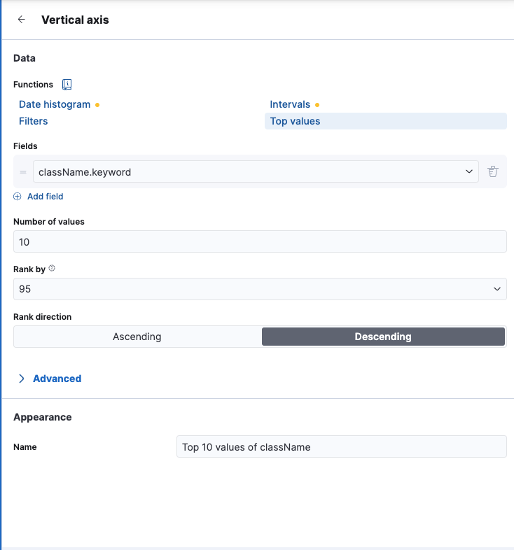
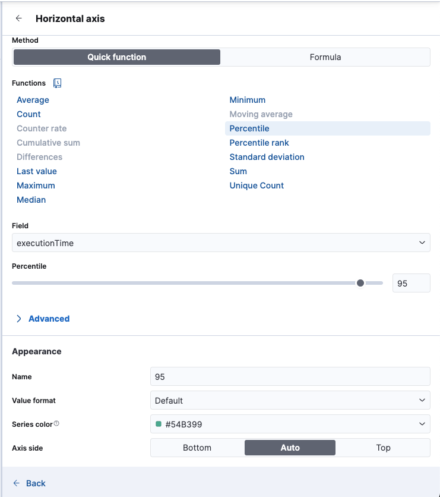
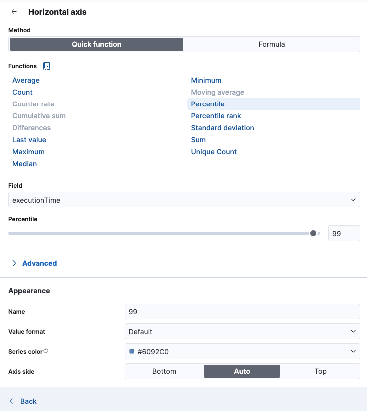
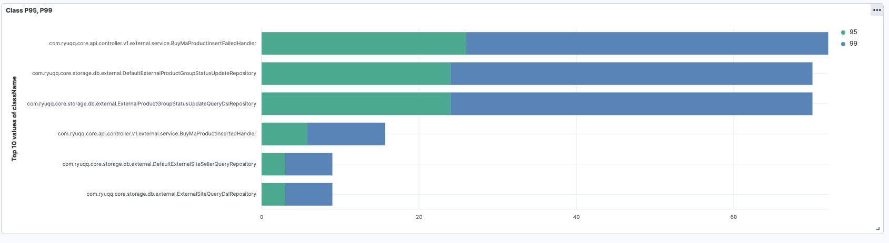

# 성능 저하 감지 (P95, P99 응답 시간 분석)
## 차트 유형: Bar Chart
### X축: Class name (XXQureyRepository, XXFailHandler 등)
### Y축: 응답 시간 (ms)
### 설명:
- 특정 서비스의 응답 시간이 지속적으로 증가하면 성능 저하 신호
- 배포 후 성능 변화 분석 가능

## 📌 P95, P99 응답 시간 개념 정리

### **1️⃣ P95, P99의 의미**
- **P95 (95th Percentile)**: 전체 요청의 **95%는 이 시간보다 빠르고**, **5%의 요청은 이보다 더 느림**
- **P99 (99th Percentile)**: 전체 요청의 **99%는 이 시간보다 빠르고**, **1%의 요청은 이보다 더 느림**

✅ **쉽게 말해서:**
- **P95** → 상위 5%의 가장 느린 요청 포함
- **P99** → 상위 1%의 가장 느린 요청 포함
- **P100** → 최대 응답 시간 (최악의 경우)

### **2️⃣ 왜 P95, P99를 분석하는가?**
✅ **평균(Avg) 응답 시간만 보면 안 되는 이유**
- 평균 응답 시간이 200ms라고 해도, 일부 요청이 3초(3000ms) 걸릴 수 있음
- 실제 서비스에서는 평균보다 최악의 응답 시간이 더 중요

✅ **P95, P99를 보는 이유:**
1. **성능 저하 감지**: 평균 응답 시간이 낮아도 P95, P99가 높으면 일부 사용자가 매우 느린 응답을 경험함
2. **슬로우 쿼리 탐지**: DB에서 특정 요청이 오래 걸릴 경우 P99 응답 시간이 급증
3. **SLA (서비스 수준 계약) 모니터링**: "99%의 요청이 1초 이내에 응답해야 한다" 같은 SLA 준수 여부 확인 가능

### **3️⃣ P95, P99 계산 방식**
✅ **P95, P99는 전체 요청을 정렬한 후 특정 % 위치의 응답 시간을 찾는 것**

1. **모든 요청을 응답 시간이 작은 순서로 오름차순 정렬**
2. **전체 요청 개수 × 0.95 위치에 있는 응답 시간이 P95**
3. **전체 요청 개수 × 0.99 위치에 있는 응답 시간이 P99**

예제) **10개 요청의 응답 시간**

| 요청 ID | 응답 시간 (ms) | 백분위수(%) |
|------|------|------|
| 요청 1 | 10ms | 10% |
| 요청 2 | 15ms | 20% |
| 요청 3 | 20ms | 30% |
| 요청 4 | 22ms | 40% |
| 요청 5 | 23ms | 50% |
| 요청 6 | 23.5ms | 60% |
| 요청 7 | 24ms | 70% |
| 요청 8 | 28ms | 80% |
| **요청 9** | **30ms** | **90%** |
| **요청 10** | **35ms** | **100%** |

✅ **P95 계산:**
- 요청 개수 = `10개`
- P95 위치 = `10 × 0.95 = 9.5 번째 값`
- **9번째 값(30ms)과 10번째 값(35ms) 사이 → 약 32.5ms로 보간하여 계산**

✅ **P99 계산:**
- P99 위치 = `10 × 0.99 = 9.9 번째 값`
- **10번째 값(35ms)에 가까움 → 약 34.8ms로 계산**

### **4️⃣ P95, P99가 의미하는 것**
✅ **P95 = "전체 요청 중에서 95%가 이 시간보다 빠름"**
✅ **P99 = "전체 요청 중에서 99%가 이 시간보다 빠름"**
✅ **P95, P99가 높을수록 일부 사용자가 매우 느린 응답을 경험할 가능성이 있음**
✅ **배포 후 P99가 증가하면 성능 저하 가능성이 높음 → 즉시 분석 필요**

🔥 **P95, P99는 평균이 아니라, "순위 기반 퍼센트 값"이다 **

### 대시보드 만드는법

#### className 설정

#### 95 설정

#### 99 설정

### 결과물 
